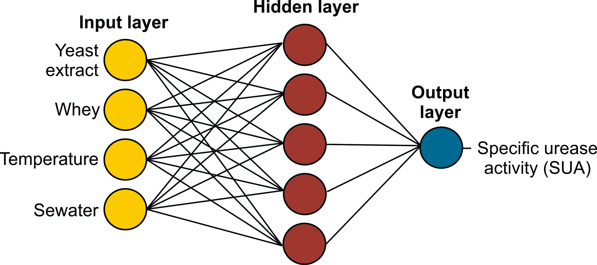

# Machine-Learning-ANNs-applied-to-Geotechnical-issues

This repository is related to an application of ANNs to a Geotechnical (MICP) issue. 

## Problem
For this approach we used MICP datasets from the state-of-the-art to be applied an optimization process via Artificial Neural Network.
Based on the existing multi independent variables  and to determine the responses, methodologies for the optimization of such processes are 
used based on experimental data. For that, the Response Surface Method (RSM) is a useful tool and widely used for this purpose. 
However, other alternatives have become viable with the development of machine learning, such as Artificial Neural Networks (ANN). 

## Aplication 
This study applied and compared the optimization of the specific urease activity (SUA) and 
the calcium carbonate (CaCO3) precipitation rate previously performed through RSM by different authors and optimized the 
same variables through ANN. As it is shown in the next Figure, the inputs, hidden and output layers for the first case.

The coefficient of determination (R2), average absolute deviation (AAD), and absolute error were analyzed and compared between the two methodologies, 
also generating surface responses for the optimized ANN. With that, two neural networks, ANN 1 (for SUA) and ANN 2 (for CaCO3 precipitation) were developed and 
applied to the data sets of both studies. As a result, ANN 1 and ANN 2 obtained coefficient errors of 0.9575 and 0.9968, respectively 
(compared to coefficient errors via the RSM of 0.9021 and 0.8530, respectively). AAD and absolute error also demonstrated better accuracy. 
Therefore, the optimal conditions of the ANNs were more accurate compared to the experimental data compared to the RSM methodology. 

## The main references for this approach were:

*Case 01: Kahani et al. (2020) as the ref. goes: Kahani M, Kalantary F, Soudi MR, et al (2020) Optimization of cost effective culture medium for Sporosarcina pasteurii as biocementing agent using response surface methodology: Up cycling dairy waste and seawater. J Clean Prod 253:120022. doi: 10.1016/j.jclepro.2020.120022

*Case 02: Okyay and Rodrigues 2014 as the refs goes: Okyay TO, Rodrigues DF (2014) Optimized carbonate micro-particle production by Sporosarcina pasteurii using response surface methodology. Ecol Eng 62:168–174. doi: 10.1016/j.ecoleng.2013.10.024

